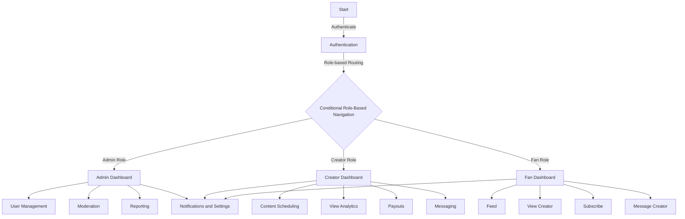

<div align="center">
  <h1> ✨ Next Gen Management Agency (NGMA) ✨ </h1>
  <p>
    
    
    
    
    
  </p>
</div>

## 🌟 Project Branding

- **Name**: Next Gen Management Agency (NGMA)  
- **Tagline**: "By Digital Herencia"  
- **Domain**: [nextgenmanagementagency.vercel.app](https://nextgenmanagementagency.vercel.app)  
- **Repository**: [GitHub: NextGenManagementAgency_v3](https://github.com/DigitalHerencia/NextGenManagementAgency_v3)  

### 🎨 Branding Colors
| **Type**            | **Color**   |
|----------------------|-------------|
| Accent              | `#ff00ff`  |
| Alternate Accent    | `#00ffff`  |
| Gradient            | `#ff00ff` → `#00ffff` |
| Main Text           | `#ffffff`  |
| Background          | `#0a0a0a`  |

### ✍️ Font
- **Bebas Neue**


## 🛠️ Project Overview

The NGMA is a **Next.js 15-based OnlyFans Management Web App** developed for **Next Gen Management Agency**, branded under "By Digital Herencia." It enables creators to manage content, connect with fans, and monetize their work efficiently. Key features include:

- Creator Dashboard
- Fan Dashboard
- Admin Tools
- Media Management
- Notifications System
- Secure Payment Integration
- Advanced Role-based Navigation


## ✅ Project To-Do List

### General Tasks
- [ ] Branding Setup
- [ ] Legal and Security Setup

### Feature Development
- [ ] Authentication System  
- [ ] Creator Dashboard  
- [ ] Fan Dashboard  
- [ ] Admin Dashboard  
- [ ] Media Management  
- [ ] Notification System  
- [ ] Content Monetization Features  

### Optimization
- [ ] UI/UX Libraries Integration  
- [ ] State Management  
- [ ] Backend Integration  
- [ ] Testing and Performance  


## 📚 Directory Structure

```plaintext
project/
├── public/              # Static assets
├── src/
│   ├── components/      # Reusable UI components
│   ├── pages/           # Next.js page routes
│   │   ├── auth/        # Authentication pages (login, register)
│   │   ├── dashboard/   # Creator/Admin/Fan dashboards
│   │   ├── content/     # Content pages (feed, posts)
│   │   ├── settings/    # User settings
│   │   └── admin/       # Admin-specific pages
│   ├── hooks/           # Custom React hooks
│   ├── lib/             # Helper functions and API calls
│   ├── layouts/         # Page layouts
│   ├── middleware/      # Authentication and role checks
│   ├── styles/          # Tailwind CSS files
│   ├── utils/           # Utility functions
│   └── store/           # Redux store and slices
├── prisma/              # Prisma schema
├── .env                 # Environment variables
├── next.config.js       # Next.js configuration
├── package.json         # Dependencies
└── tsconfig.json        # TypeScript configuration
```

## 🗒 Flow Chart



## 📊 Data Modeling Diagram

### Users Table
| **Field**        | **Type**  |
|-------------------|-----------|
| user_id (PK)      | UUID      |
| email             | String    |
| password_hash     | String    |
| role              | Enum      |
| created_at        | DateTime  |

### Content Table
| **Field**        | **Type**  |
|-------------------|-----------|
| content_id (PK)   | UUID      |
| creator_id (FK)   | UUID      |
| type              | Enum      |
| title             | String    |
| file_url          | String    |
| price             | Float     |
| created_at        | DateTime  |


## 🚀 Optimization for Ivan's Workflow

1. **Deployment**:  
   - [Vercel](https://vercel.com) for deployment  
   - MongoDB Atlas for database hosting

2. **Media Management**:  
   - **Cloudinary** for media optimization

3. **Development Tools**:  
   - Visual Studio Code  
   - ESLint, Prettier, and Tailwind CSS extensions  

4. **Performance**:  
   - **Next.js** API routes for serverless functions  
   - **Cloudinary SDK** for optimized media delivery  


## 🖼 Assets

| **Asset**               | **Path**                         |
|--------------------------|-----------------------------------|
| favicon.ico              | public/favicon.ico              |
| Main Black Logo          | public/assets/logo-main-black.png |
| Background Shape         | public/assets/background-shape.svg |
| Mark Black Icon          | public/assets/icon-mark-black.svg |

